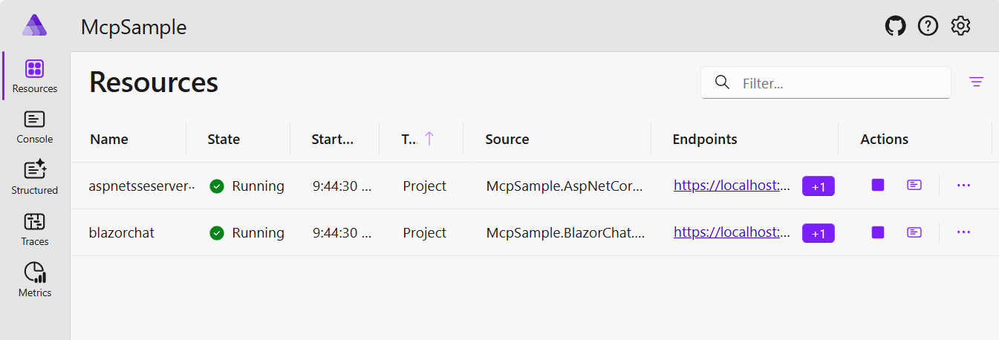
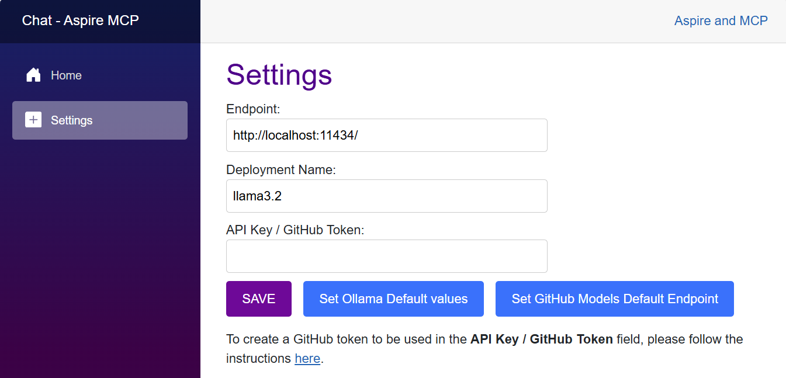
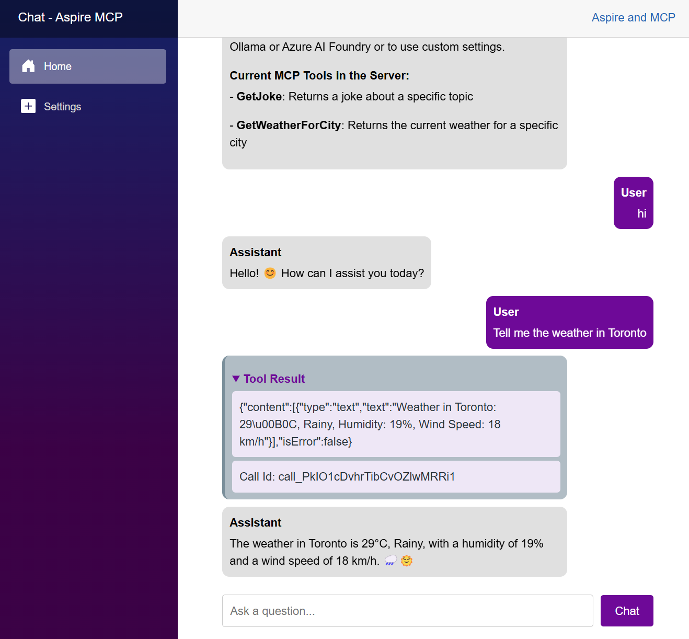

# Aspire.MCP.Sample

Sample MCP Server and MCP client using Aspire.

## Overview

This sample demonstrates a Model Context Protocol (MCP) Server and client setup using Aspire. It showcases how to establish and manage MCP communication, using C# in a structured Aspire environment.

### Quick Demo

[](https://www.youtube.com/watch?v=2holzbob1_I)

Check out this 5-minute video overview to see the project in action.


## Features

- **MCP Server:** Implements an MCP server to manage client communication.
- **MCP Client:** Sample Blazor Chat client demonstrating how to connect and communicate with the MCP server.
- **Aspire Integration:** Uses Aspire for containerized orchestration and service management.

## Getting Started

### Prerequisites

- .NET SDK 9.0 or later  
- Visual Studio 2022 or Visual Studio code
- LLM or SLM that supports function calling.
	- [Azure AI Foundry](https://ai.azure.com) to run models in the cloud. IE: gpt-4o-mini
	- [Ollama](https://ollama.com/) for running local models. Suggested: phi4-mini, llama3.2 or Qwq

### Run locally

1. Clone the repository:

1. Navigate to the Aspire project directory:

   ```bash
   cd .\src\McpSample.AppHost\
   ```

1. Run the project:
   ```bash
   dotnet run
   ```

1. In the Aspire Dashboard, navigate to the Blazor Chat client project.



1. In the Chat Settings page, define the model to be used. You choose to use models in Azure AI Foundry (suggested gpt-4o-mini), GitHub Models or locally with ollama (suggested llama3.2)



1. Now you can chat with the model. Everytime that one of the functions of the MCP server is called, the `Tool Result` section will be displayed in the chat.



## Architecture Diagram

**(WIP)**
- High-level architecture diagram will be added soon.

## GitHub Codespaces

**(WIP)**
- Codespaces configuration will be added soon.

## Deployment

### Local Deployment


### Azure Deployment

## Contributing
Contributions are welcome! Feel free to submit issues and pull requests.

## License
This project is licensed under the MIT License.

